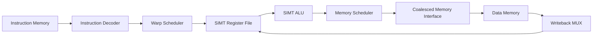
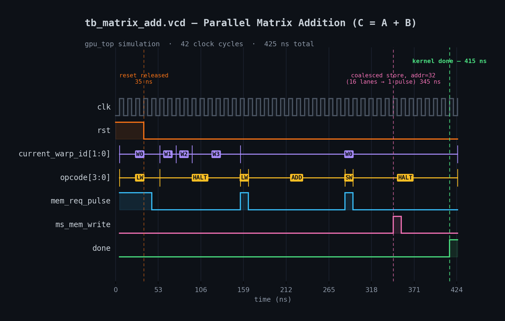
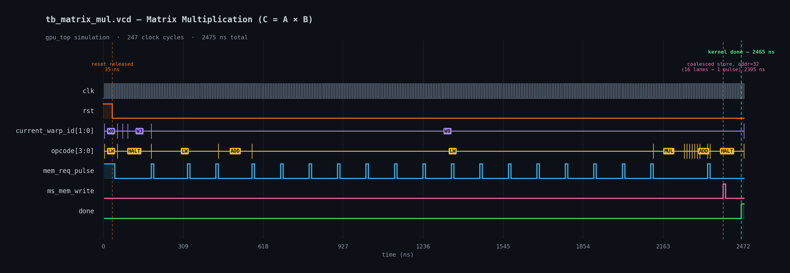

# SIMT GPU Architecture for Parallel Matrix Operations

A Verilog implementation of a **SIMT (Single Instruction Multiple Threads) GPU architecture** capable of executing parallel matrix kernels. The design includes a warp scheduler, SIMT ALU, coalesced memory subsystem, register file, and instruction execution pipeline.

The project demonstrates:

- Parallel **Matrix Addition (C = A + B)**
- Parallel **Matrix Multiplication (C = A × B)**
- Warp scheduling
- Memory coalescing
- SIMT execution
- Functional verification using VCD waveforms

---

# Features

- 16-lane SIMT execution engine
- 4 Warp Scheduler
- Register File per lane
- SIMT ALU
- Memory Scheduler with request coalescing
- Shared Data Memory
- Instruction Decoder
- Load/Store support
- Matrix Addition kernel
- Matrix Multiplication kernel
- Complete Verilog testbenches
- GTKWave compatible VCD generation

---

# Architecture



---

# Overall Data Flow

```text
              +-------------------+
              | Instruction Memory|
              +---------+---------+
                        |
                        v
             +----------------------+
             | Instruction Decoder  |
             +----------+-----------+
                        |
                        v
              +--------------------+
              | Warp Scheduler     |
              +----------+---------+
                         |
                         v
              +--------------------+
              | Register File      |
              +----------+---------+
                         |
                         v
                  +--------------+
                  | SIMT ALU     |
                  +------+-------+
                         |
             +-----------+------------+
             |                        |
             |                        |
             v                        v
     Write Back                Memory Scheduler
                                       |
                                       v
                            Coalesced Memory Access
                                       |
                                       v
                                 Data Memory
```

---

# Project Structure

```text
├── rtl/
│   ├── gpu_top.v
│   ├── alu.v
│   ├── simt_alu.v
│   ├── warp_scheduler.v
│   ├── memory_scheduler.v
│   ├── reg_file_simt.v
│   ├── instruction_memory.v
│   ├── data_memory.v
│   └── ...
│
├── tests/
│   ├── tb_matrix_add.v
│   ├── tb_matrix_mul.v
│
├── programs/
│   ├── matrix_add.mem
│   ├── matrix_mul.mem
│
├── waves/
│   ├── tb_matrix_add.vcd
│   ├── tb_matrix_mul.vcd
│
└── README.md
```

---

# Matrix Addition

The addition kernel computes

\[
C = A + B
\]

where every lane computes one matrix element.

Example input matrices:

### Matrix A

|1|2|3|4|
|-|-|-|-|
|5|6|7|8|
|9|10|11|12|
|13|14|15|16|

### Matrix B

|1|0|0|0|
|-|-|-|-|
|0|1|0|0|
|0|0|1|0|
|0|0|0|1|

Output

|2|2|3|4|
|-|-|-|-|
|5|7|7|8|
|9|10|12|12|
|13|14|15|17|

---

# Matrix Multiplication

The multiplication kernel computes

\[
C = A \times B
\]

For the supplied test case, Matrix B is the Identity matrix.

Therefore

\[
C = A
\]

Output

|1|2|3|4|
|-|-|-|-|
|5|6|7|8|
|9|10|11|12|
|13|14|15|16|

---

# Simulation Results

Both kernels execute successfully.

| Test | Result |
|-------|--------|
| Matrix Addition | PASS |
| Matrix Multiplication |  PASS |

---

# Matrix Addition Waveform



The waveform illustrates:

- Reset release
- Warp execution
- Load instructions
- ALU ADD operation
- Coalesced Store
- Kernel completion

Execution summary

| Metric | Value |
|---------|------:|
| Clock Cycles | 42 |
| Runtime | 425 ns |

---

# Matrix Multiplication Waveform



The waveform shows:

- Multiple memory loads
- Multiply operations
- Accumulation
- Coalesced memory store
- Kernel completion

Execution summary

| Metric | Value |
|---------|------:|
| Clock Cycles | 247 |
| Runtime | 2475 ns |

---

# Memory Coalescing

The memory scheduler combines requests from multiple SIMD lanes accessing the same cache line into a single memory transaction.

Benefits include:

- Reduced memory traffic
- Improved bandwidth utilization
- Lower execution latency
- Higher throughput

---

# Test Output

Matrix Addition

```
=== Matrix Addition : PASS ===
```

Matrix Multiplication

```
=== Matrix Multiplication : PASS ===
```

---

# Future Improvements

- Branch divergence handling
- Cache hierarchy
- Shared memory
- Pipelined execution
- Floating-point ALU
- Tensor core instructions
- Multiple Streaming Multiprocessors (SMs)

---

# Author
Bibhav Jha

Designed for parallel matrix computation, warp scheduling, and memory coalescing demonstrations.